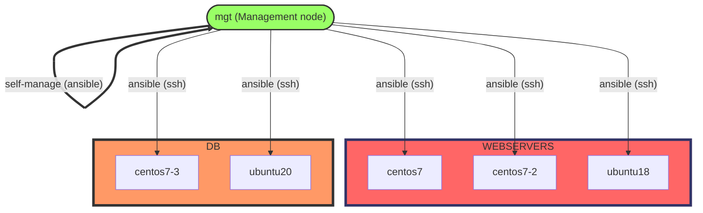

# LCA2022 - Playtime with configuration: from shell to galaxy

## Table of Contents
- [Acknowledgement of the Country](#acknowledgement-of-the-country)
- [Abstract](#abstract)
- [TL;DR](#tldr)
- [Initial setup](#initial-setup)
- [My simple ansible architecture](#my-simple-ansible-architecture)
- [More info](#more-info)

##  Acknowledgement of the Country
I would like to acknowledgement the Traditional Custodians of the country which this talk is recorded and streaming from.  I would also like to pay my respect to their Elders past and present.

## Abstract
In the Linux world, there are many ways that you can setup and configure your systems.  There are at least 10 configuration orchestration tools out there.  To name a few: ansible, cfengine, pupper, chef, salt and many others.  

When I first started learning Linux, I did  my configuration with bash scripts + ssh.  Then I crank up to cfengine, and try out  puppet master.  Finally, I ended up playing with ansible and living with it since then.  

I want to share my ansible journey, from shell to galaxy with you.

## TL;DR
- This is a placeholder of how I got my VMs setup, bash scripts and ansible playbooks/roles created for LCA2022 tech talk
- VirtualBox + vagrant are used to setup the VMs used in the demo  
- bash/ directory kept the shell scripts used in the demo
- ansible/ directory kept the ansible playbooks used in the demo

## Prerequisite
1. [VirtualBox](https://www.virtualbox.org/)
1. [Vagrant](https://www.vagrantup.com/)
1. [Git](https://git-scm.com/downloads）

## Initial setup
1. Clone this git repo - `git clone https://github.com/serheang/lca2022-ansible.git`  
1. Change directory into `vagrant` - `cd lca2022-ansible/vagrant`  
1. Setup the necessary VMs with `vagrant` - `vagrant up`
    > If you want to have AWX as well, the you will need to run this after the above completed - `vagrant up awx`
	> You should take a snapshot of the existing VMs state so that you can quicky restore if something went wrong - `vagrant snapshot save b4anything`
1. If you have a ssh client, such as putty (Windows/Linux), you can ssh into VM **mgt**, via the IP: 192.168.56.100.  Or you can use `vagrant` - `vagrant ssh mgt`
    > If you just run `vagrant ssh` it will by default go to **mgt**
1. In **mgt**, first you change directory to `/srv/lca2022-ansible/` - `cd /srv/lca2022-ansible/`.
1. Then you can either go to `bash/` (shell scripts) or `ansible/` (playbooks and roles) to run relevant tasks.

## My simple ansible architecture
I used [Mermaid](https://mermaid-js.github.io/mermaid/#/) to visualize my diagram, so this might not render correctly in github.  You might need to use [Mermaid Live Editor](https://mermaid.live/) to render the visualization.  

Here is a screen capture:


## Bash example
1. In **mgt**, change directory to `/srv/lca2022-ansible/bash` - `cd /srv/lca2022-ansible/bash`.
1. You can run `my-setup.sh` onto any of hosts in file `webservers`, which is "centos7", "centos7-2" and "ubuntu18".
    > You can run it in this way:
	```
	for host in `cat webservers`; do
	ssh $host 'sudo bash -s' < my-setup.sh
	done
	```
1. You can check out further details in the `bash/README.md`.

## Ansible example
1. In **mgt**, change directory to `/srv/lca2022-ansible/ansible` - `cd /srv/lca2022-ansible/ansible`.
1. You can run ansible playbook `my-setup.yml` onto any of hosts in file `hosts`, which is "centos7", "centos7-2" and "ubuntu18".
	```
	ansible-playbook my-setup.yml 
	```
1. You can check out further details in the `ansible/README.md`.

## More info
Here is a placeholder for the shell scripts, ansible playbooks/roles and Vagrantfile that I used in my talk.  
