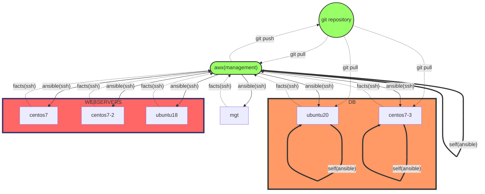

# LCA2022 - Playtime with configuration: from shell to galaxy

## Table of Contents
- [Acknowledgement of the Country](#acknowledgement-of-the-country)
- [Abstract](#abstract)
- [TL;DR](#tldr)
- [Initial setup](#initial-setup)
- [Ansible architecture(s) used in demo](#ansible-architectures-used-in-demo)
- [My simple ansible architecture](#my-simple-ansible-architecture)
- [Bash quick guide](#bash-quick-guide)
- [Ansible quick guide](#ansible-quick-guide)
- [Resources and references](#resources-and-references)


##  Acknowledgement of the Country
I would like to acknowledgement the Traditional Custodians of the country/land and pay my respect to their Elders past and present.

## Abstract
In the Linux world, there are many ways that you can setup and configure your systems.  There are at least 10 configuration orchestration tools out there.  To name a few: ansible, cfengine, pupper, chef, salt and many others.  
When I first started working in Linux, I did my system configuration and setup with bash scripts + ssh.  Then I crank up to cfengine, and tried to be puppet master.  And eventually, I found a whole new galaxy with ansible, and since then I have been playing and learning with ansible.

I just want to share my ansible discovery journey, from shell to galaxy with you.

And there is my journey in loving ansible:


I started doing configuration manually back in 2000 – it was not fun 22 years ago, and I am confident it is not fun today. Tried using shell scripts for configuration, it was still not fun.  It got worst and complex when there are different Linux distros and other OS in your systems.  
Then, I discovered the power of configuration tools like cfengine (2005), puppet (2013).  But I never like either 1 of them :(  
Finally, in 2012, I was shine by a raising star in the galaxy - ansible!  When I first started with ansible, I only utilized the basic module: script, shell, command, but even that it gave me a lot of confidence especially I do not require to rewrite all my scripts immediately into the configuration syntax (YAML) and that gave me time to learn and change from shell script to yaml.  
  

## TL;DR
- This is a placeholder of how I got my VMs setup, bash scripts and ansible playbooks/roles created for LCA2022 tech talk
- VirtualBox + vagrant (and git obviously) are used to setup the VMs used in the demo  
- vagrant/ directory kept the `Vagrantfile` and other ansible playbooks and config files for setting up the VMs for demo
- bash/ directory kept the shell scripts used in the demo
- ansible/ directory kept the ansible playbooks used in the demo

## Prerequisite
1. [VirtualBox](https://www.virtualbox.org/)
1. [Vagrant](https://www.vagrantup.com/)
1. [Git](https://git-scm.com/downloads）

## Initial setup
1. Clone this git repo - `git clone https://github.com/serheang/lca2022-ansible.git`  
1. Change directory into `vagrant` - `cd lca2022-ansible/vagrant`  
1. Setup the necessary VMs with `vagrant` - `vagrant up`
    > If you want to have AWX as well, the you will need to run this after the above completed - `vagrant up awx`
	> You should take a snapshot of the existing VMs state so that you can quicky restore if something went wrong - `vagrant snapshot save b4anything`
1. If you have a ssh client, such as putty (Windows/Linux), you can ssh into VM **mgt**, via the IP: 192.168.56.100.  Or you can use `vagrant` - `vagrant ssh mgt`
    > If you just run `vagrant ssh` it will by default go to **mgt**
1. In **mgt**, first you change directory to `/srv/lca2022-ansible/` - `cd /srv/lca2022-ansible/`.
    > If you want to ensure all the scripts and/or ansible playbooks/roles or any info is updated, the you run `sudo git pull` first.
1. Then you can either go to `bash/` (shell scripts) or `ansible/` (playbooks and roles) to run relevant tasks.

## Ansible architecture(s) used in demo  
### My simple ansible architecture
This is the ansible architecture design I used in my ansible demo.
> I used [Mermaid](https://mermaid-js.github.io/mermaid/#/) to visualize my diagram, so this might not render correctly in github.  You might need to use [Mermaid Live Editor](https://mermaid.live/) to render the visualization.  
This is the diagram (or the code) for mermaid:

Here is a screen capture of the diagram:


### My slightly complex ansible architecture design with github repo + AWX
This is the architecture design after I incorporate AWX and github into the demo used AWX demo:
> I used [Mermaid](https://mermaid-js.github.io/mermaid/#/) to visualize my diagram, so this might not render correctly in github.  You might need to use [Mermaid Live Editor](https://mermaid.live/) to render the visualization.  
This is the diagram (or the code) for mermaid:

Here is a screen capture of the diagram:


## Bash quick guide
1. In **mgt**, change directory to `/srv/lca2022-ansible/bash` - `cd /srv/lca2022-ansible/bash`.
1. You can run `my-setup.sh` onto any of hosts in file `webservers`, which is "centos7", "centos7-2" and "ubuntu18".
    > You can run it in this way:
	```
	for host in `cat webservers`; do
	ssh $host 'sudo bash -s' < my-setup.sh
	done
	```
1. You can check out further details in the `bash/README.md`.

## Ansible quick guide
1. In **mgt**, change directory to `/srv/lca2022-ansible/ansible` - `cd /srv/lca2022-ansible/ansible`.
1. You can run ansible playbook `my-setup.yml` onto any of hosts in file `hosts`, which is "centos7", "centos7-2" and "ubuntu18".
	```
	ansible-playbook my-setup.yml 
	```
1. You can check out further details in the `ansible/README.md`.


## Resources and references  
1. [Ansible in DevOps](https://www.ansiblefordevops.com/) by [Jeef Geerling](https://www.jeffgeerling.com/)
1. [You should speak](https://youtu.be/3QIQNcGnXes) by E. Dunham (the real @qedunham on LinkedIn and Twitter)
1. [Ansible 2.9 Documentation](https://docs.ansible.com/ansible/2.9/user_guide/quickstart.html)
1. [Ansible AWX 17.1.0](https://github.com/ansible/awx/blob/17.1.0/INSTALL.md)  
